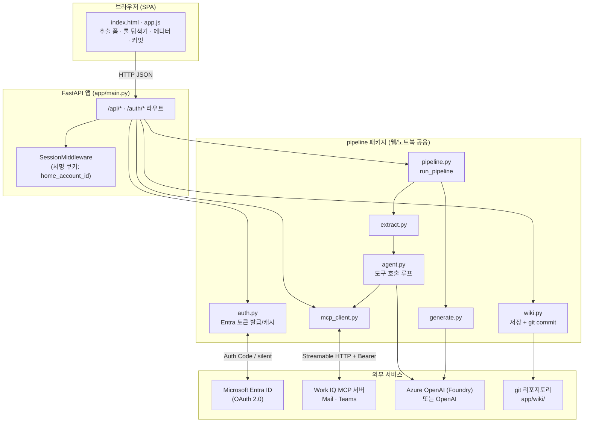
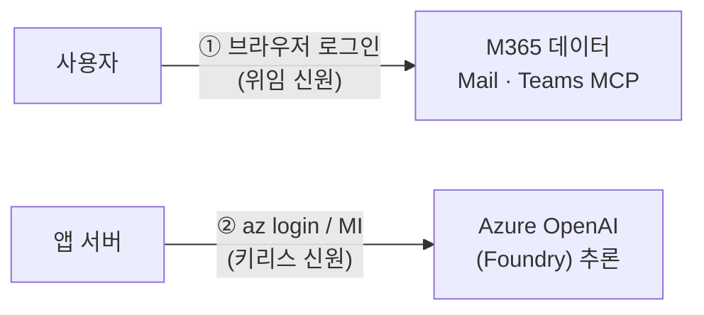
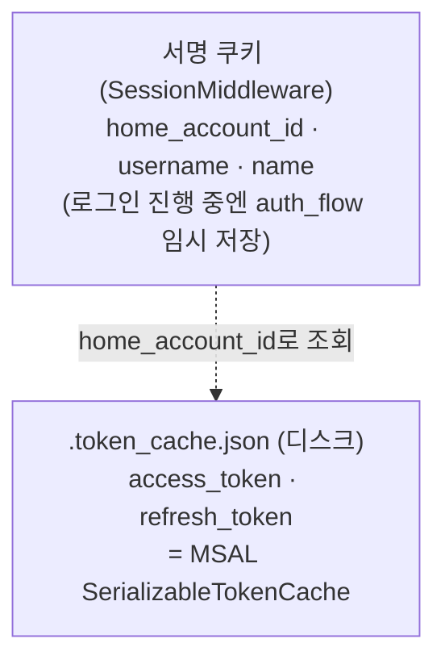
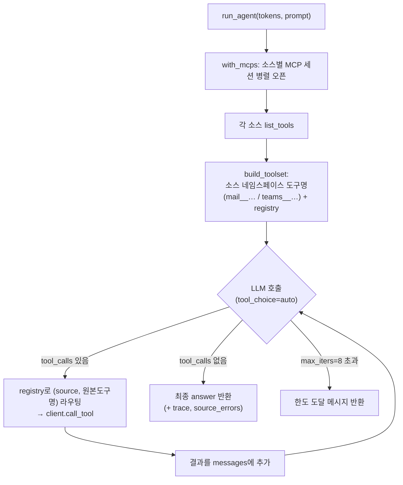
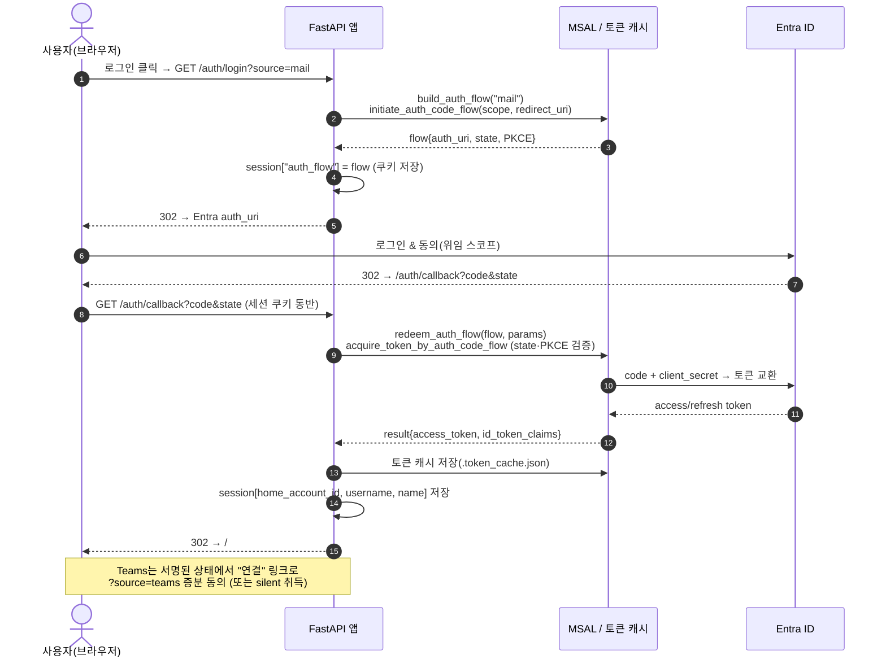
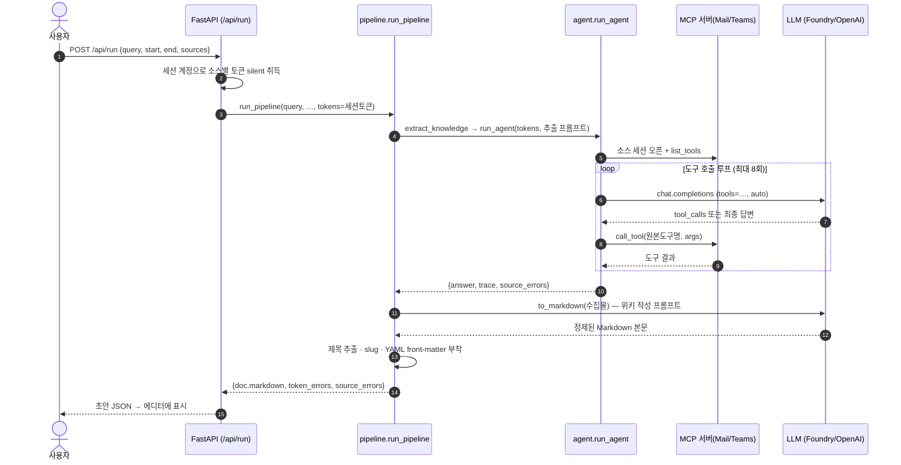
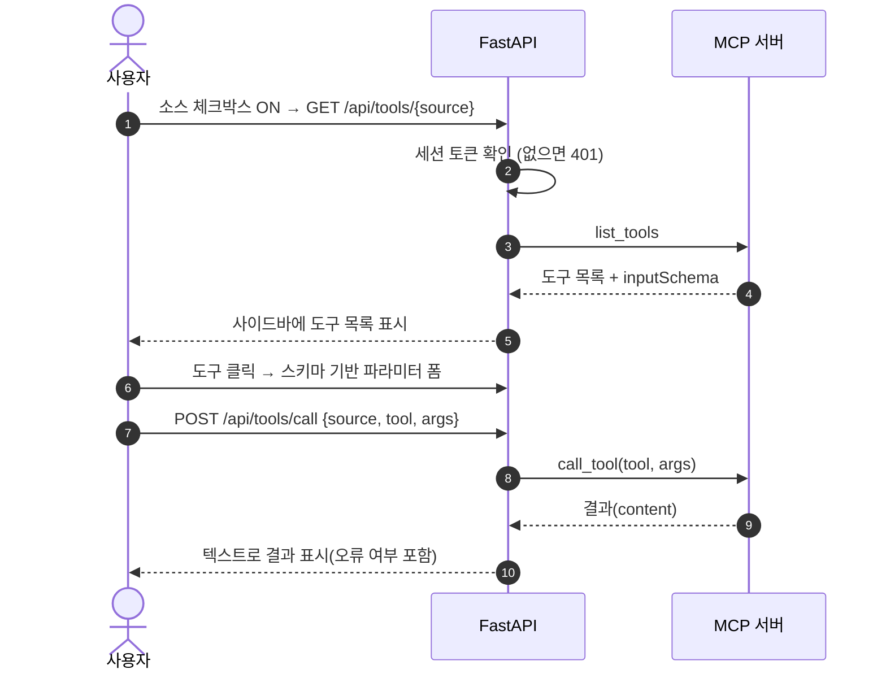
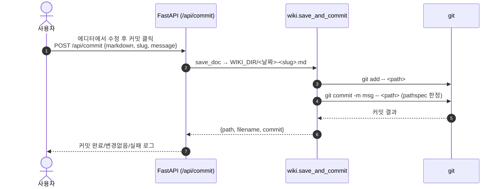

# LLM Wiki Pipeline — 기술 문서 (Architecture)

Microsoft **Work IQ MCP 서버**(Teams / Mail)에서 팀의 기술 지식·노하우를 자연어로
수집하고, LLM으로 정제하여 **Markdown 위키 문서**로 만들어 저장·커밋하는 파이프라인입니다.

이 문서는 프로젝트의 목적, 인증 구조, 아키텍처, 전체 동작 시퀀스를 설명합니다.

---

## 목차

1. [프로젝트 개요](#1-프로젝트-개요)
2. [핵심 개념](#2-핵심-개념)
3. [디렉터리 구조](#3-디렉터리-구조)
4. [아키텍처](#4-아키텍처)
5. [인증(Authentication) 상세](#5-인증authentication-상세)
6. [파이프라인 동작](#6-파이프라인-동작)
7. [전체 시퀀스 다이어그램](#7-전체-시퀀스-다이어그램)
8. [웹 API 레퍼런스](#8-웹-api-레퍼런스)
9. [노트북(파이프라인 학습용)](#9-노트북파이프라인-학습용)
10. [설정(환경 변수)](#10-설정환경-변수)
11. [보안 고려사항](#11-보안-고려사항)

---

## 1. 프로젝트 개요

### 무엇을 하는가

- **입력**: 자연어 주제(예: *"이번 주 Kafka 컨슈머 재처리 트러블슈팅 노하우"*) + 날짜 범위 + 소스(Mail/Teams)
- **처리**: 선택한 MCP 소스에서 관련 메시지/메일을 **에이전트가 도구 호출로 수집** → LLM이 **정제된 위키 페이지(Markdown)로 생성**
- **출력**: 사람이 브라우저에서 **검토·수정**한 뒤 위키 디렉터리에 저장하고 **git 커밋**

### 두 가지 실행 방식

| 방식 | 위치 | 용도 |
|------|------|------|
| **웹 앱** | `app/` (FastAPI) | 실사용 UI. 브라우저 로그인 → 추출 → 리뷰 → 커밋 |
| **노트북** | `notebook/` (Jupyter) | 파이프라인 단계를 학습·검증하는 순차 실습 |

두 방식은 **동일한 `pipeline` 패키지**(`app/pipeline/`)를 공유합니다. 웹 앱은 사용자별
세션 토큰을 주입하고, 노트북은 device-code 로그인 후 공유 토큰 캐시를 사용한다는 점만
다릅니다.

### 설계 원칙

- **Human-in-the-loop**: 파이프라인은 **초안만** 만들고, 사람이 검토·수정한 뒤에만 저장/커밋합니다. `run_pipeline`은 절대 스스로 저장하지 않습니다.
- **소스 격리**: Mail과 Teams는 서로 다른 OAuth 리소스라 **토큰을 공유하지 않습니다.** 에이전트도 한 소스의 데이터를 다른 소스로 쓰기(write)하지 않도록 프롬프트로 제약합니다.
- **신원 분리**: M365 데이터 접근 신원(사용자 위임 로그인)과 LLM 추론 신원(Azure/Foundry)은 완전히 별개입니다.

---

## 2. 핵심 개념

### MCP (Model Context Protocol)

Work IQ가 Teams/Mail 기능을 **MCP 서버**로 노출합니다. 각 서버는 `list_tools`(사용 가능
도구 목록)와 `call_tool`(도구 실행)을 제공하며, 본 프로젝트는 **Streamable HTTP** 전송으로
연결합니다. 모든 요청 헤더에 `Authorization: Bearer <token>`을 실어 인증합니다.

### 두 개의 소스(Source)

`config.py`의 `SOURCES`에 정의됩니다.

| key | 라벨 | MCP 서버 (TENANT_ID에서 자동 유도) | 스코프 |
|-----|------|----------------------------------|--------|
| `mail` | Mail | `.../servers/mcp_MailTools` | `<mail-url>/.default` |
| `teams` | Teams | `.../servers/mcp_TeamsServer` | `<teams-url>/.default` |

두 서버는 같은 Entra 리소스 앱(audience `https://agent365.svc.cloud.microsoft`)
뒤에 있지만 **각각 다른 위임 스코프**(`McpServers.Mail.All` / `McpServers.Teams.All`)를
요구하므로, **소스별로 별도 토큰**을 발급합니다. Mail 스코프 토큰은 Teams 서버에서
거부되고 그 반대도 마찬가지입니다.

---

## 3. 디렉터리 구조

```text
llmwiki-pipeline/
├─ app/
│  ├─ main.py                 # FastAPI 진입점 (라우트 + 세션 + 정적 파일)
│  ├─ pipeline/               # 웹/노트북 공용 핵심 로직
│  │  ├─ config.py            # .env 로드, SOURCES, LLM 설정, Config
│  │  ├─ auth.py              # Entra 인증(Auth Code/PKCE, device-code, 토큰 캐시)
│  │  ├─ mcp_client.py        # MCP(Streamable HTTP) 세션 헬퍼
│  │  ├─ agent.py             # LLM 도구 호출 에이전트 루프
│  │  ├─ extract.py           # 1단계: 자연어 추출 (에이전트 실행)
│  │  ├─ generate.py          # 2단계: 추출물 → 위키 Markdown 생성
│  │  ├─ pipeline.py          # extract→generate 오케스트레이션
│  │  └─ wiki.py              # 3단계: 저장 + git 커밋
│  ├─ static/                 # 프론트엔드(SPA)
│  │  ├─ index.html
│  │  ├─ app.js
│  │  └─ styles.css
│  └─ wiki/                   # 생성된 위키 문서 출력 (WIKI_DIR)
├─ notebook/                  # 파이프라인 학습용 노트북 01~04 + README
├─ .env / .env.example        # 환경 설정 (.env는 gitignore)
├─ requirements.txt
├─ README.md / SETUP.md
└─ ARCHITECTURE.md            # (이 문서)
```

---

## 4. 아키텍처

### 계층 구조



### 구성 요소 역할

| 구성 요소 | 책임 |
|-----------|------|
| **app/main.py** | HTTP 라우트, 사용자 세션, 정적 파일 서빙. 세션 토큰을 파이프라인에 주입 |
| **auth.py** | Entra 토큰 발급(브라우저 로그인 / device-code), 토큰 캐시, 소스별 silent 취득 |
| **mcp_client.py** | MCP 세션 열기/닫기(요청 단위), `list_tools`/`call_tool`, 결과 텍스트 변환 |
| **agent.py** | LLM ↔ MCP 도구 호출 루프. 소스 네임스페이스 도구 등록 + 라우팅 |
| **extract.py** | 추출 프롬프트 구성 후 에이전트 실행 → 원본 자료 수집 |
| **generate.py** | 수집물 → 정제된 위키 Markdown + YAML front-matter 생성 |
| **pipeline.py** | 추출→생성 오케스트레이션, 토큰/에러 취합 |
| **wiki.py** | 문서 파일 저장 + pathspec 한정 git 커밋 |

---

## 5. 인증(Authentication) 상세

이 프로젝트에는 **완전히 분리된 두 개의 신원**이 있습니다. 이 구분이 인증 이해의 핵심입니다.



| | ① M365 데이터 접근 | ② LLM 추론 |
| --- | --- | --- |
| **누구의 신원?** | **로그인한 사용자**(위임) | **앱/개발자**(`az login` 또는 Managed Identity) |
| **무엇에 쓰나?** | Mail/Teams MCP 도구 호출 | 추출·문서 생성용 chat completion |
| **어떻게?** | Authorization Code + PKCE, 앱은 기밀 클라이언트(CLIENT_SECRET) | `DefaultAzureCredential`로 Entra 토큰(키리스) 또는 API 키 |
| **스코프** | `<mcp-url>/.default` (소스별) | `https://cognitiveservices.azure.com/.default` |

### 5.1 M365 사용자 로그인 (웹 앱)

`samples/mcp-web-sample`와 동일하게 **Authorization Code + PKCE** 플로우를 씁니다.

- **앱은 기밀 클라이언트**입니다. `CLIENT_SECRET`이 설정되어 있으면
  `ConfidentialClientApplication`, 없으면 공개 클라이언트(PKCE 전용)로 폴백합니다
  (`auth.py::_get_app`).
- MSAL의 `initiate_auth_code_flow` / `acquire_token_by_auth_code_flow`가 **PKCE와
  state를 내부적으로** 처리합니다. 앱이 직접 PKCE를 구현하지 않습니다.
- **소스별 로그인**: Mail과 Teams가 다른 OAuth 리소스이므로 `?source=`로 어느 리소스에
  (증분) 동의할지 선택합니다. 최초 로그인이 계정을 만들고, 이후 Teams 등 다른 소스는
  가능하면 **silent**로 토큰을 얻으며, 아직 동의 안 된 소스는 UI에 **"연결" 링크**로
  증분 동의를 유도합니다.

### 5.2 세션 & 토큰 저장 모델



- **쿠키에는 토큰을 절대 넣지 않습니다.** `home_account_id`, `username`, `name`만
  저장하며 4KB 쿠키 한도 아래로 유지됩니다. 쿠키는 `itsdangerous`로 서명되어 변조 불가.
- **액세스/리프레시 토큰**은 서버 측 MSAL 토큰 캐시(디스크 `.token_cache.json`)에만
  존재합니다. 요청 시 `token_for_account(home_account_id, source)`가 `acquire_token_silent`로
  소스별 토큰을 조회합니다.
- **로그아웃**(`POST /api/logout`)은 캐시에서 계정을 제거(`remove_account`)하고 세션을
  비웁니다.

> **⚠️ 호스트 일관성 (중요)**: `redirect_uri`가 `http://localhost:8000/auth/callback`
> 이므로 앱을 **반드시 `localhost:8000`으로 접속**해야 합니다. `127.0.0.1:8000`으로
> 접속하면 `/auth/login`에서 설정한 세션 쿠키가 `/auth/callback`에 전달되지 않아
> "진행 중인 로그인이 없습니다" 오류가 납니다. 또한 이 redirect URI는 Entra 앱 등록의
> **Web 플랫폼 리디렉션 URI**로 등록되어 있어야 합니다.

### 5.3 LLM(Foundry) 키리스 인증

`agent.py::make_openai`:

- `AZURE_OPENAI_API_KEY`가 비어 있으면 **키리스**로 동작 → `DefaultAzureCredential`
  (=`az login` 자격 증명 또는 Managed Identity)로 Entra 토큰을 얻어 `AzureOpenAI`를 구성합니다.
- 해당 신원은 데이터플레인 롤(예: *Cognitive Services OpenAI User*)이 필요합니다.
- **주의**: 환경에 `AZURE_OPENAI_API_KEY=""`(빈 문자열)가 남아 있으면 openai SDK가
  이를 "설정됐지만 잘못된 키"로 오인해 *Missing credentials* 오류를 냅니다. 따라서
  키리스 클라이언트 생성 전에 해당 환경 변수를 제거합니다.

### 5.4 노트북/CLI용 device-code (레거시)

노트북에서는 위임 사용자 로그인을 **device-code 플로우**(`login_device_code`)로 한 번
수행하고 토큰 캐시에 저장해 재사용합니다. `client_credentials`(앱 전용) 모드도 있으나
MCP 서버가 위임 스코프를 노출하므로 보통 사용하지 않습니다.

---

## 6. 파이프라인 동작

`run_pipeline(query, start, end, sources, tokens=…)` → **추출 → 생성** 2단계.
저장/커밋은 사람이 검토 후 별도로 호출합니다.

### 6.1 단계별 흐름

1. **소스 정리** (`resolve_sources`) — 요청된 소스 검증, 미지정 시 전체.
2. **토큰 준비** — 웹 앱은 세션 토큰(`tokens=`)을 그대로 사용, 누락 소스는 한국어
   에러 메시지 생성. (노트북은 캐시에서 `gather_tokens`.)
3. **추출** (`extract.py`) — `build_extraction_prompt`로 "날짜 범위 내 재사용 가능한
   기술 지식만 수집" 지시 → `run_agent` 실행.
4. **에이전트 루프** (`agent.py`) — 아래 6.2.
5. **생성** (`generate.py`) — 수집 자료를 *senior technical writer* 시스템 프롬프트로
   정제, H1 제목 추출 → slug 생성 → YAML front-matter(`title, generated, sources,
   date_range, query, generator`) 부착.
6. 결과 반환: `doc.markdown`, `token_errors`, `source_errors`, `extract.answer`.

### 6.2 에이전트 도구 호출 루프



- **도구명 네임스페이싱**: 모델에게 노출되는 이름은 `<source>__<tool>`이며, registry가
  이를 `(source_key, 원본 도구명)`으로 되돌립니다 → 모델이 준 이름을 신뢰하지 않고 안전
  라우팅.
- **소스별 에러 격리**: 한 소스 연결 실패가 다른 소스를 막지 않고 `source_errors`로 보고.
- 도구 결과는 8000자로 잘라 대화에 반영, 최대 8회 반복.

### 6.3 저장 & 커밋 (`wiki.py`)

- `save_doc`: `WIKI_DIR/<YYYY-MM-DD>-<slug>.md`로 기록.
- `git_commit`: **pathspec 한정 커밋** — 해당 파일 경로만 `git add`/`commit`하여
  무관한 스테이징 변경이 위키 커밋에 섞이지 않도록 합니다.
- `read_doc`은 위키 디렉터리 밖 경로 접근을 차단(path traversal 방지).

---

## 7. 전체 시퀀스 다이어그램

### 7.1 로그인 (Authorization Code + PKCE, 소스별)



**동작 설명**

1. 사용자가 헤더의 **로그인**을 누르면 `/auth/login?source=mail`로 이동.
2. 앱이 MSAL로 해당 소스의 Auth Code 플로우를 시작(스코프 = `<mail-url>/.default`).
3. MSAL이 `auth_uri`·`state`·PKCE 챌린지가 포함된 flow 딕셔너리를 반환.
4. flow 전체를 **세션에 임시 저장**(콜백에서 state·PKCE 검증에 필요).
5. 브라우저를 Entra 인가 엔드포인트로 302 리디렉션.
6. 사용자가 Microsoft 계정으로 로그인하고 위임 스코프에 동의.
7. Entra가 인가 코드를 붙여 `/auth/callback`으로 되돌림.
8. 브라우저가 콜백을 호출(같은 호스트라 세션 쿠키 동반 — localhost 일관성 필요).
9. 앱이 세션에서 flow를 꺼내 `acquire_token_by_auth_code_flow` 호출.
10. MSAL이 코드+클라이언트 시크릿으로 Entra와 토큰 교환(내부에서 state·PKCE 검증).
11~12. 액세스/리프레시 토큰 수신.
13. 토큰을 **디스크 캐시에 저장**(쿠키가 아님).
14. 세션에는 `home_account_id`·표시 이름만 저장.
15. 앱 홈으로 복귀 → 상태 폴링으로 `signedIn: true` 반영.

### 7.2 추출 실행 (추출 → 생성)



**동작 설명**

1. 사용자가 주제·날짜·소스로 **추출 실행**.
2. 앱이 세션 계정으로 선택된 소스의 토큰을 silent 취득(없으면 토큰 에러).
3. 토큰을 주입해 `run_pipeline` 실행.
4. 추출 단계가 에이전트를 기동(수집 지침 프롬프트 전달).
5. 에이전트가 소스별 MCP 세션을 열고 도구 목록을 가져옴.
6. **도구 호출 루프**: LLM이 검색/조회 도구를 골라 호출하고, 결과를 근거로 다음 행동
   결정. 관련 기술 지식만 남기고 잡담·일정 등은 제외.
7. 최종 수집 자료(`answer`) + 트레이스 반환.
8. 생성 단계가 LLM(도구 없음)으로 위키 페이지를 작성.
9. H1 제목 추출 → slug 생성 → 출처·범위·질의 등 front-matter 부착.
10. 초안 Markdown을 브라우저 에디터로 반환. **아직 저장하지 않음.**

### 7.3 MCP 툴 탐색기 (직접 호출)



**동작 설명**: 소스가 연결되면 도구 목록을 불러오고, 도구를 클릭하면 그 도구의 JSON
입력 스키마로부터 **파라미터 입력 폼**(타입/필수/enum 반영)을 만들어, 실제로 인자를
넘겨 호출하고 결과를 확인할 수 있습니다. 파이프라인을 돌리기 전에 개별 도구를
탐색·검증하는 용도입니다.

### 7.4 리뷰 & 커밋



**동작 설명**: 사용자가 초안을 검토·수정한 뒤 커밋하면, 위키 디렉터리에 파일로 저장하고
**해당 파일 경로만** 대상으로 git 커밋합니다. 변경이 없으면 커밋하지 않고 그대로 보고합니다.

---

## 8. 웹 API 레퍼런스

| 메서드 | 경로 | 설명 |
|--------|------|------|
| `GET` | `/api/status` | LLM 제공자, 인증 방식, `signedIn`, 사용자, 소스별 연결 상태 |
| `GET` | `/auth/login?source=` | 해당 소스로 Entra 로그인 리디렉션 시작 |
| `GET` | `/auth/callback` | 인가 코드 수신 → 토큰 교환 → 세션 저장 → `/`로 복귀 |
| `POST` | `/api/logout` | 캐시에서 계정 제거 + 세션 클리어 |
| `GET` | `/api/tools/{source}` | 소스의 MCP 도구 목록 + inputSchema (미로그인 시 401) |
| `POST` | `/api/tools/call` | 도구 1개를 인자와 함께 호출, 결과 텍스트 반환 |
| `POST` | `/api/run` | 추출→생성 실행, 초안 Markdown 반환 (LLM 미설정 시 412) |
| `POST` | `/api/commit` | 초안 저장 + git 커밋 |
| `GET` | `/api/docs` | 위키 문서 목록 |
| `GET` | `/api/docs/{filename}` | 위키 문서 1개 내용 |
| `GET` | `/` | SPA(index.html) |

프론트엔드(`app.js`)는 30초마다 `/api/status`를 폴링해 로그인/연결 상태, 소스별 "연결"
링크, 로그인·로그아웃 버튼 표시를 갱신합니다.

---

## 9. 노트북(파이프라인 학습용)

`notebook/`은 웹 앱과 같은 `pipeline` 패키지를 쓰되, 각 단계를 순차적으로 실습하도록
구성됩니다. (자세한 설명·시퀀스는 `notebook/README.md` 참고.)

| 노트북 | 내용 |
|--------|------|
| `01_setup_mcp.ipynb` | MCP 연결 + 위임 로그인(device-code) 및 토큰 캐시 |
| `02_seed_sample_data.ipynb` | 샘플 데이터 시드(테스트용) |
| `03_fetch_data.ipynb` | MCP 도구로 데이터 조회 |
| `04_nl_aggregate_to_md.ipynb` | 자연어 추출 → Markdown 생성 |

노트북과 웹 앱의 주요 차이는 **인증뿐**입니다: 노트북은 device-code로 한 번 로그인 후
공유 캐시를 사용하고, 웹 앱은 사용자별 브라우저 로그인 세션 토큰을 주입합니다.

---

## 10. 설정(환경 변수)

`.env`(gitignore) — 전체 목록·튜토리얼은 `.env.example`, `SETUP.md` 참고.

| 변수 | 용도 |
|------|------|
| `TENANT_ID` | Mail/Teams MCP 서버를 소유한 테넌트. MCP URL 자동 유도의 기준 |
| `CLIENT_ID` | Entra 앱 등록의 Application(client) ID |
| `CLIENT_SECRET` | **설정 시 기밀 클라이언트**로 웹 로그인. 비우면 공개(PKCE) 클라이언트 |
| `MAIL_MCP_SERVER_URL` / `TEAMS_MCP_SERVER_URL` | (선택) 비표준 URL일 때만 지정, 보통 공란 |
| `AUTH_MODE` | 노트북/CLI용 (`device_code` 권장 / `client_credentials`). 웹 로그인은 항상 Auth Code |
| `TOKEN_CACHE_PATH` | 토큰 캐시 파일 경로(`.token_cache.json`) — **자격 증명 취급, gitignore** |
| `REDIRECT_URI` | 기본 `http://localhost:8000/auth/callback` — Entra에 **Web** 리디렉션으로 등록 필수 |
| `SESSION_SECRET` | 세션 쿠키 서명 키(운영에서는 반드시 변경) |
| `AZURE_OPENAI_ENDPOINT` / `_DEPLOYMENT` / `_API_VERSION` | Azure OpenAI(Foundry) 설정 |
| `AZURE_OPENAI_API_KEY` | **비우면 키리스**(`az login`/MI). 값이 있으면 키 인증 |
| `OPENAI_API_KEY` / `OPENAI_MODEL` | 대안: 공개 OpenAI API (외부 전송 주의) |
| `WIKI_DIR` | 위키 출력 디렉터리(기본 `app/wiki`) |

**실행**:
```bash
cd app
uvicorn main:app --reload --port 8000
# 브라우저에서 http://localhost:8000  (127.0.0.1 아님)
```

---

## 11. 보안 고려사항

- **자격 증명 커밋 금지**: `.env`, `.token_cache.json`, `*.token_cache.json`은 gitignore.
  토큰 캐시는 `chmod 600` 권장.
- **토큰은 쿠키에 없음**: 세션 쿠키엔 `home_account_id`/표시명만. 액세스/리프레시 토큰은
  서버 측 MSAL 캐시에만 존재하고 `itsdangerous` 서명 쿠키로 세션 무결성 보장.
- **소스 격리**: 소스별 별도 토큰·스코프. 에이전트가 한 소스 데이터를 다른 소스에 쓰지
  않도록 시스템 프롬프트로 제약.
- **신원 최소권한**: LLM 키리스 신원은 데이터플레인 롤(예: *Cognitive Services OpenAI
  User*)만 부여. M365 위임 스코프는 관리자 동의 필요.
- **커밋 범위 제한**: 위키 커밋은 대상 파일 경로만 pathspec으로 한정해 부수 변경 유입 차단.
- **경로 탈출 방지**: 문서 읽기는 위키 디렉터리 밖 경로를 거부.
- **운영 전환 시**: `SESSION_SECRET` 교체, HTTPS 사용 시 세션 미들웨어 `https_only=True`,
  실제 도메인 redirect URI를 Entra에 등록.
