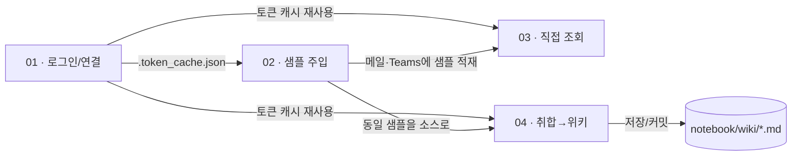
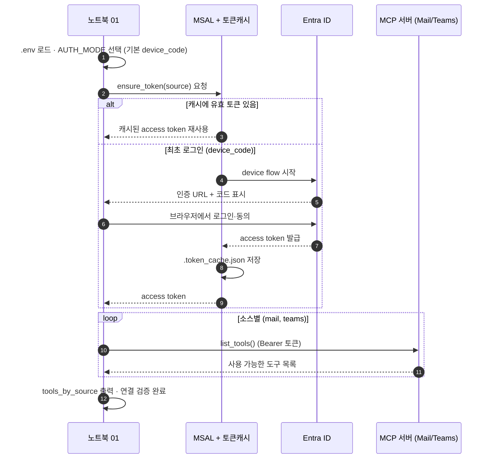
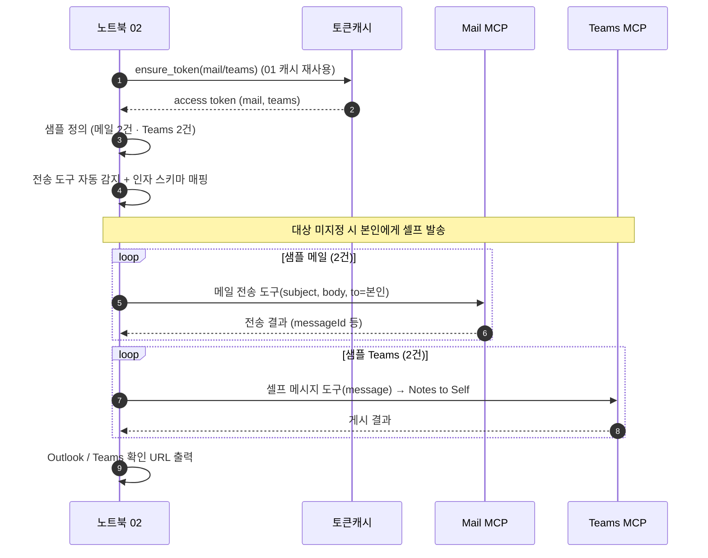
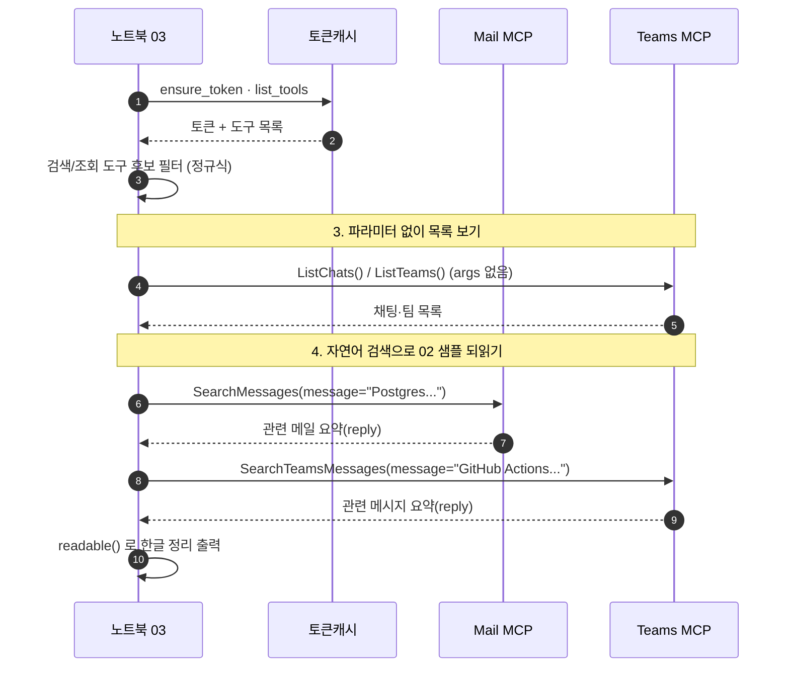
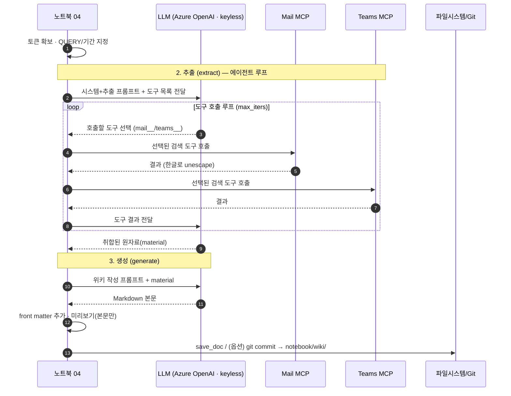
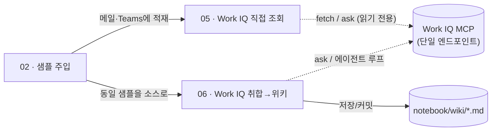

# LLM Wiki 파이프라인 노트북 가이드

Microsoft 365 **Work IQ MCP**(Agent365)에 연결해 메일·Teams 데이터를 다루고, 최종적으로 LLM으로 사내 기술 위키(Markdown)를 자동 생성하는 노트북 모음입니다. `pipeline/*.py`나 웹앱 없이 **노트북만으로 독립 실행**되도록 구성되어 있습니다.

노트북은 **커넥터(연결 방식)** 두 가지를 다룹니다.
- **01~04 · Agent365 MCP** — 메일/Teams가 **각각의 MCP 서버**로 분리되어 있고, 서버마다 `SearchMessages` 같은 **소스별 전용 도구**를 노출합니다.
- **05~06 · Work IQ MCP** — **단일 엔드포인트**(`https://workiq.svc.cloud.microsoft/mcp`)가 `fetch`/`ask`/`search_paths` 등 **범용 10개 도구**(Graph 경로 기반)를 노출합니다. 01~04를 Work IQ로 다시 구현한 것으로, 흐름은 03/04와 동일합니다.

| 노트북 | 커넥터 | 목적 | 핵심 결과물 |
|--------|--------|------|-------------|
| `01_setup_mcp.ipynb` | Agent365 | MCP 연결·인증·툴 목록 확인 | `.token_cache.json` (로그인 캐시) |
| `02_seed_sample_data.ipynb` | Agent365 | 샘플 기술/노하우 데이터 주입 | 메일 2건 + Teams 2건 (본인에게) |
| `03_fetch_data.ipynb` | Agent365 | MCP 도구 **직접 호출**로 데이터 조회 | 주입 데이터 되읽기 확인 |
| `04_nl_aggregate_to_md.ipynb` | Agent365 | 자연어 취합 → 위키 Markdown 생성 | `notebook/wiki/*.md` |
| `05_workiq_fetch_data.ipynb` | **Work IQ** | Work IQ 범용 도구 **직접 호출**로 데이터 조회 | 주입 데이터 되읽기 확인 |
| `06_workiq_aggregate_to_md.ipynb` | **Work IQ** | Work IQ 취합 → 위키 Markdown 생성 | `notebook/wiki/*.md` |

권장 실행 순서는 **01 → 02 → 03 → 04**이며, Work IQ 버전을 보려면 **02(샘플 주입) 이후 05 → 06**을 실행합니다. 01~04는 `.token_cache.json`을, 05~06은 별도의 `.workiq.token_cache.json`을 재사용합니다(커넥터가 달라 로그인이 각각 1회 필요).

---

## 사전 준비

1. **가상환경 / 의존성**: 저장소 루트(`llmwiki-pipeline/`)의 `.venv` 사용, `requirements.txt` 설치.
2. **`.env` 설정** (루트에 위치, git 추적 안 함):

   ```ini
   # Entra 앱 / 테넌트
   TENANT_ID=<테넌트 GUID>
   CLIENT_ID=<앱 등록 클라이언트 ID>
   CLIENT_SECRET=            # 방법 2(client_credentials)에서만 필요
   AUTH_MODE=device_code     # device_code(방법1·기본) | client_credentials(방법2)

   # MCP 서버 URL (비우면 TENANT_ID로 자동 구성)
   MAIL_MCP_SERVER_URL=
   TEAMS_MCP_SERVER_URL=

   # LLM (04에서만 사용) — Azure OpenAI / Foundry
   AZURE_OPENAI_ENDPOINT=https://<리소스>.cognitiveservices.azure.com/
   AZURE_OPENAI_DEPLOYMENT=gpt-5.4
   AZURE_OPENAI_API_VERSION=2025-04-01-preview
   AZURE_OPENAI_API_KEY=     # 비우면 Entra 키리스(az login) 사용
   ```

3. **LLM 키리스(권장)**: `AZURE_OPENAI_API_KEY`를 비워두면 `DefaultAzureCredential`로 인증합니다. 먼저 `az login` 하고, Foundry/OpenAI 리소스에 **Cognitive Services OpenAI User** 역할이 있어야 합니다.

---

## 공통 개념 (모든 노트북 공통)

### 인증 — 2가지 방법
- **방법 1 · device_code (기본·권장)**: 사용자 위임(delegated) 로그인. 최초 1회 브라우저에서 코드 입력 → 이후 `.token_cache.json` 재사용. Entra 앱에 **"공개 클라이언트 흐름 허용 = 예"** 필요.
- **방법 2 · client_credentials**: 앱 전용 토큰. `CLIENT_SECRET` + **애플리케이션 권한(관리자 동의)** 필요.

`AUTH_MODE`로 전환하며, 두 방법 모두 `ensure_token(source)` 하나로 처리됩니다.

### MCP 연결 패턴
모든 노트북은 동일한 최신 MCP SDK 패턴을 씁니다(구 `streamablehttp_client`는 deprecated).

```python
async with create_mcp_http_client(headers={'Authorization': f'Bearer {token}'}) as http_client:
    async with streamable_http_client(url, http_client=http_client) as (r, w, _):
        async with ClientSession(r, w) as s:
            await s.initialize()
            ...  # list_tools() / call_tool()
```
- `create_mcp_http_client`가 MCP 권장 타임아웃이 설정된 `httpx.AsyncClient`를 만들고, 그 클라이언트를 `streamable_http_client`에 넘깁니다.
- **호출자가 http_client 수명을 관리**(위처럼 `async with`)해야 합니다.

### 소스와 토큰
데이터 소스는 **Mail**과 **Teams** 두 개이며, 서버마다 delegated 스코프가 달라 **소스별로 access token을 각각** 발급합니다(`tokens = {'mail': ..., 'teams': ...}`). MCP 서버 URL은 다음 형태입니다.

```
https://agent365.svc.cloud.microsoft/agents/tenants/{TENANT_ID}/servers/mcp_MailTools
https://agent365.svc.cloud.microsoft/agents/tenants/{TENANT_ID}/servers/mcp_TeamsServer
```

### 출력 한글 처리
Work IQ 검색 도구는 결과를 `\uXXXX`로 이스케이프된 JSON **텍스트 블록 여러 개**로 반환합니다. 03의 `readable()`(블록별 파싱 후 `reply` 추출)과 04의 `content_to_text()`(블록별 `ensure_ascii=False` 재직렬화)가 이를 **한글로 복원**합니다.

---

## 전체 데이터 흐름



- **01**은 로그인 결과(`.token_cache.json`)를 만들어 02·03·04가 모두 재사용합니다.
- **02**가 메일·Teams에 넣은 샘플을 **03**(직접 조회)과 **04**(LLM 취합)가 소스로 사용합니다.
- **04**의 결과만 파일(`notebook/wiki/`)로 남습니다.

---

## 01 · MCP 연결 · 인증 · 툴 목록

**흐름**: `.env` 로드 → 인증 방법 선택 → 로그인(토큰 확보) → 소스별 `list_tools()`로 연결 검증. 성공하면 `.token_cache.json`이 생겨 이후 노트북이 재로그인 없이 동작합니다.



**각 동작 설명**
1. **.env 로드 & 방법 선택** — 설정을 읽고 `AUTH_MODE`(기본 `device_code`)를 정합니다.
2. **ensure_token 요청** — 소스(mail/teams)별 토큰을 요청합니다.
3. **캐시 재사용** — `.token_cache.json`에 유효 토큰이 있으면 그대로 사용(재로그인 없음).
4. **device flow 시작** — 캐시가 없으면 device-code 로그인을 개시합니다.
5. **URL·코드 안내** — `https://microsoft.com/devicelogin`과 코드를 출력합니다.
6. **로그인·동의** — 사용자가 브라우저에서 로그인/권한 동의합니다.
7. **토큰 발급** — Entra가 access token을 발급합니다.
8. **캐시 저장** — 토큰을 `.token_cache.json`에 저장(이후 노트북 공유).
9. **토큰 반환** — 노트북이 토큰을 획득합니다.
10. **list_tools 호출** — 소스별로 MCP 서버의 도구 목록을 조회합니다.
11. **도구 목록 수신 & 검증** — `tools_by_source`로 저장·출력하면 연결 확인 완료입니다.

---

## 02 · 샘플 기술/노하우 데이터 주입

**흐름**: 01의 캐시로 토큰 확보 → 샘플(메일 2건·Teams 2건) 정의 → 전송 도구 자동 감지 및 인자 스키마 매핑 → **MCP 도구를 직접 호출**해 발송 → 확인용 URL 출력. `MAIL_TO`/`TEAMS_TO`가 비어 있으면 **로그인한 본인에게** 셀프 발송합니다.



**각 동작 설명**
1. **토큰 요청** — 01의 `.token_cache.json`을 재사용해 mail/teams 토큰을 얻습니다.
2. **토큰 수신** — 두 소스의 access token을 확보합니다.
3. **샘플 정의** — Postgres·k8s(메일), GitHub Actions 캐시·로그 표준(Teams) 등 재사용 가능한 노하우를 정의합니다.
4. **도구 자동 감지 + 매핑** — 이름 패턴으로 전송 도구(예: `SendEmailWithAttachments`, `SendMessageToSelf`)를 고르고, 논리 인자(subject/body/message/to)를 실제 스키마 파라미터명·타입에 맞춰 변환합니다.
5. **대상 결정(Note)** — `MAIL_TO`가 비면 `signed_in_email()`로 본인 주소를, `TEAMS_TO`가 비면 **Notes to Self**를 대상으로 합니다.
6. **메일 전송** — 샘플 2건을 메일 MCP 도구로 직접 발송합니다.
7. **메일 결과** — 각 발송 결과(messageId 등)를 출력합니다.
8. **Teams 게시** — 셀프 메시지 도구로 본인 채팅(Notes to Self)에 게시합니다(chatId 불필요).
9. **Teams 결과** — 게시 결과를 출력합니다.
10. **확인 URL** — Outlook 받은/보낸 편지함, Teams 채팅 링크를 출력해 눈으로 확인하게 합니다.

---

## 03 · MCP 함수 직접 호출로 데이터 가져오기

**흐름**: 토큰·툴 목록 확보 → 검색/조회 도구 후보 필터 → **(3)파라미터 없이 목록** 조회로 감 잡기 → **(4)자연어 검색**으로 02에서 넣은 샘플을 되읽기. LLM/에이전트 없이 **도구를 그대로 호출**하는 것이 핵심입니다.



**각 동작 설명**
1. **토큰·툴 요청** — 캐시 토큰으로 소스별 도구 목록을 가져옵니다.
2. **수신** — `tokens`, `tools_by_source`를 확보합니다.
3. **후보 필터** — 정규식으로 검색/조회(read) 성격 도구를 추려 어떤 도구를 쓸지 감을 잡습니다.
4. **무파라미터 목록(Note)** — 인자가 필요 없는 도구를 그대로 호출하는 가장 단순한 예시 구간입니다.
5. **ListChats/ListTeams** — `args={}`로 호출해 내 채팅/팀 목록을 봅니다.
6. **목록 수신** — 결과를 `readable()`로 정리해 출력합니다.
7. **자연어 검색(Note)** — 02에서 주입한 데이터를 되읽는 구간입니다.
8. **SearchMessages** — 자연어 질의로 메일을 검색합니다(예: Postgres/CrashLoopBackOff).
9. **메일 결과** — 사람이 읽기 쉬운 한글 요약(`reply`)을 받습니다.
10. **SearchTeamsMessages** — 자연어 질의로 Teams 메시지를 검색합니다(예: GitHub Actions 캐시/로그 표준).
11. **Teams 결과 & 출력** — `readable()`로 한글 정리해 출력하며, 02 데이터가 그대로 조회됨을 확인합니다.

---

## 04 · 자연어 기반 취합 → 위키 Markdown 생성

**흐름**: 토큰·질의(QUERY)·기간 지정 → **(2)추출**: LLM 에이전트가 필요한 MCP 도구를 스스로 호출하며 원자료를 모음 → **(3)생성**: 모은 자료로 위키 Markdown 초안 작성 → **(4)미리보기**(본문만) → **(6)저장/커밋** `notebook/wiki/`. LLM은 Azure OpenAI(Foundry, 키리스 `az login`)를 사용합니다.



**각 동작 설명**
1. **준비** — 토큰을 확보하고 추출 질의(QUERY)와 기간(START/END)을 정합니다.
2. **에이전트 시작(Note)** — 관련 자료를 모으는 추출 단계로 들어갑니다.
3. **프롬프트+도구 전달** — 시스템/추출 프롬프트와 함께 mail·teams 도구 스펙을 LLM에 넘깁니다.
4. **도구 선택** — LLM이 어떤 도구를 어떤 인자로 부를지 결정합니다(`mail__`/`teams__` 접두어).
5~6. **Mail 검색·결과** — 노트북이 실제 Mail MCP를 호출하고, `content_to_text()`로 한글 복원된 결과를 받습니다.
7~8. **Teams 검색·결과** — 동일하게 Teams MCP를 호출합니다.
9. **결과 전달** — 도구 결과를 LLM에 되돌려주고, 충분해질 때까지 4~9를 반복합니다.
10. **원자료 완성** — LLM이 소스별로 정리된 원자료(`material`)를 반환합니다.
11. **생성 시작(Note)** — 위키 문서 작성 단계로 전환합니다.
12. **작성 프롬프트+자료** — 테크니컬 라이터 프롬프트와 `material`을 LLM에 전달합니다.
13. **Markdown 본문** — LLM이 H1/H2 구조의 위키 본문을 생성합니다.
14. **front matter + 미리보기** — 제목/출처/기간 등 YAML front matter를 붙이고, 미리보기에서는 front matter를 숨겨 본문만 렌더링합니다.
15. **저장/커밋** — `save_doc()`로 저장하고, `DO_COMMIT=True`면 해당 파일만 git 커밋해 `notebook/wiki/`에 남깁니다.

---

## 05 · Work IQ MCP 로 데이터 가져오기

**흐름**: 03과 동일하지만 커넥터가 **Work IQ MCP**(단일 엔드포인트, 범용 도구)입니다. 토큰 확보 → `list_tools`로 10개 범용 도구 확인 → `search_paths`로 사용 가능한 Graph 경로 탐색 → `fetch`로 경로를 **직접 읽기**(`/me/messages`, `/me/chats/{id}/messages`) → `ask`로 **자연어 조회**(02 샘플 되읽기).

- **핵심 차이(03 대비)**: 도구가 소스별 전용 이름(`SearchMessages`)이 아니라 **경로 기반 범용 도구**입니다. `fetch`는 원시 Graph 조회(의미검색 아님), `ask`는 M365 Copilot 의미검색/추론입니다. `/me/chats`는 채팅 **목록**이라 메시지는 `/me/chats/{id}/messages`로 한 단계 더 들어갑니다(컬렉션 기본 $top=25·최대 100, 채팅 메시지 최대 10).
- **인증**: 기본은 웹앱/01–04와 **동일한 자체 앱 등록(`CLIENT_ID`) + device-code(자체 앱, 기본)** 로 공유 `.token_cache.json`을 재사용합니다(로그인 1회로 통일). 앱 등록에 `WorkIQAgent.Ask` 위임 동의가 필요합니다. **옵션**으로 `WORKIQ_USE_PUBLIC_CLIENT=true`이면 별도 앱 등록이 필요 없는 **MS 공개 Work IQ 클라이언트**(기본 `interactive`·로컬 브라우저·루프백, 원격/헤드리스는 `WORKIQ_AUTH_MODE=device_code`, 캐시 `.workiq.token_cache.json`)를 씁니다. 어느 방식이든 **회사·학교 계정 + 관리자 동의 + EULA**가 필요합니다(개인 계정 불가).

## 06 · Work IQ MCP 로 취합 → 위키 Markdown 생성

**흐름**: 04와 동일(**extract → generate → save/commit**)하며 소스만 Work IQ입니다. 추출은 두 방식을 제공합니다.

- **기본 `extract_via_ask`** — Work IQ `ask`(M365 Copilot)가 메일·Teams를 가로질러 주제·기간에 맞는 지식을 취합합니다(간단·안정, 응답에 수십 초 소요 가능).
- **선택 `extract_via_agent`** — 04식 에이전트 루프. LLM이 Work IQ 도구를 직접 호출합니다. **안전상 읽기 전용 도구만**(`ask`/`fetch`/`search_paths`/`get_schema`/`list_agents`/`call_function`) 노출하며 쓰기 도구(create/update/delete/do_action)는 제외합니다(메일 본문의 프롬프트 인젝션 방지).

생성/저장은 04와 동일한 `to_markdown`/`save_doc`/`save_and_commit`을 재사용하고, front matter에 `connector: "Work IQ MCP"`를 기록합니다. 출력은 `notebook/wiki/`에 저장됩니다.



---

## 폴더 구조

```
notebook/
├── README.md                          # 이 문서
├── 01_setup_mcp.ipynb                 # (Agent365) 연결·인증·툴 목록
├── 02_seed_sample_data.ipynb          # (Agent365) 샘플 데이터 주입
├── 03_fetch_data.ipynb                # (Agent365) MCP 직접 호출 조회
├── 04_nl_aggregate_to_md.ipynb        # (Agent365) 자연어 취합 → 위키 생성
├── 05_workiq_fetch_data.ipynb         # (Work IQ) 범용 도구 직접 호출 조회
├── 06_workiq_aggregate_to_md.ipynb    # (Work IQ) 취합 → 위키 생성
└── wiki/                              # 04/06이 생성한 Markdown 저장 위치
```
