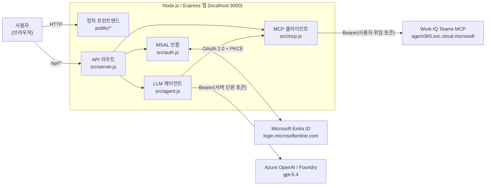
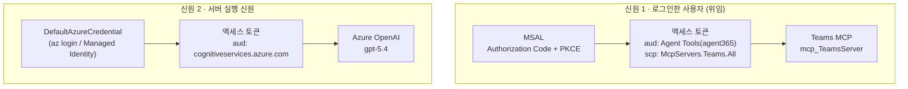
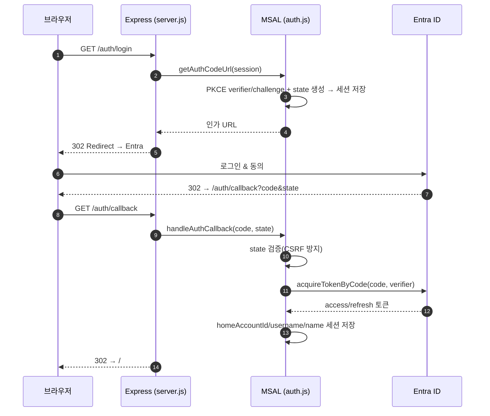
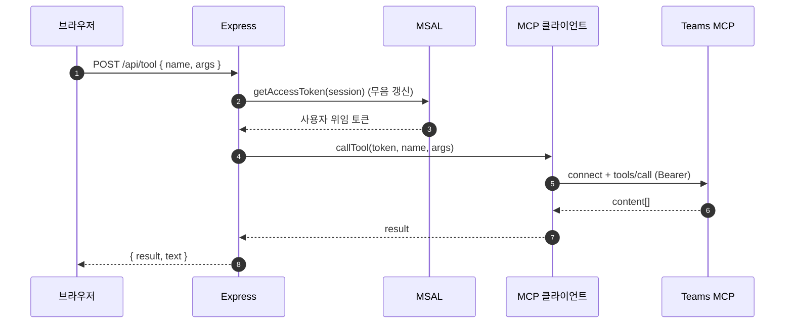
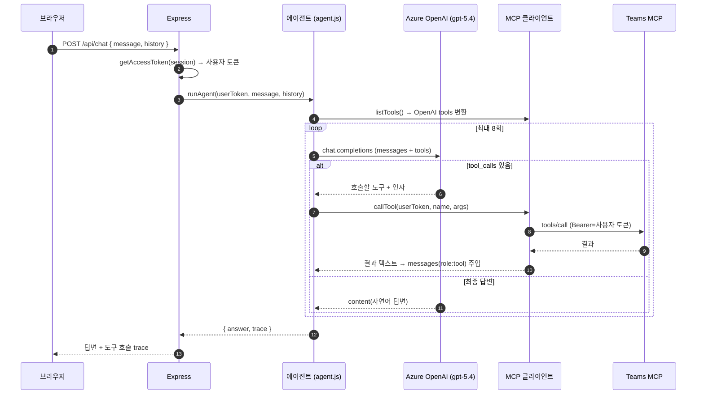
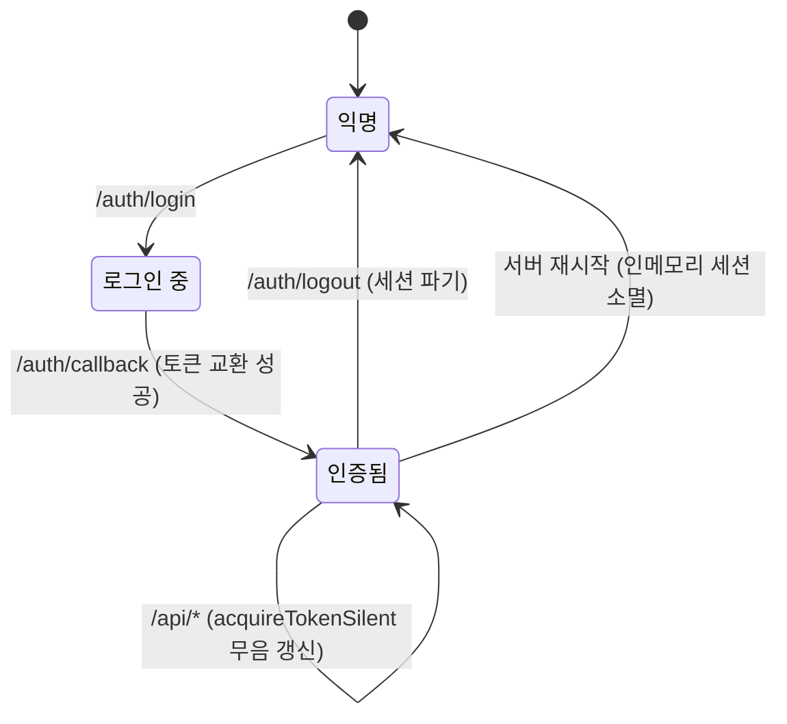

# 아키텍처 문서 — Teams MCP Web Sample

사용자가 웹 UI에서 자연어 또는 도구 호출로 요청하면, **Work IQ Teams** MCP 서버
(`mcp_TeamsServer`)를 통해 Microsoft Teams(채팅/채널/팀/멤버/메시지) 작업을 수행하고
응답을 돌려주는 샘플 애플리케이션입니다.

이 문서는 시스템 구성요소, 인증 모델, 요청 흐름, 보안 고려사항을 상세히 설명합니다.
설치·실행 방법은 [`README.md`](./README.md)를 참고하세요.

---

## 1. 한눈에 보기

- **프런트엔드**: 바닐라 JS SPA (채팅 UI + 도구 직접 실행 패널)
- **백엔드**: Node.js + Express (ESM)
- **MCP 클라이언트**: `@modelcontextprotocol/sdk` — Streamable HTTP transport
- **사용자 인증**: Entra ID OAuth 2.0 Authorization Code + PKCE (`@azure/msal-node`)
- **LLM(선택)**: Azure OpenAI(Foundry) `gpt-5.4` — **Entra ID 토큰 인증**(키리스)
- **핵심 설계 포인트**: **서로 다른 두 개의 신원(identity)** 을 사용
  1. Teams MCP 호출 → **로그인한 사용자**의 위임(delegated) 토큰
  2. Azure OpenAI 호출 → **서버 실행 신원**(`DefaultAzureCredential`)의 토큰



---

## 2. 기술 스택

| 계층 | 구성요소 | 비고 |
|------|----------|------|
| 사용자 인증 | `@azure/msal-node` | Authorization Code + PKCE, 세션에 계정 보관, 무음 갱신 |
| MCP 전송 | `@modelcontextprotocol/sdk` `StreamableHTTPClientTransport` | 모든 요청 헤더에 `Authorization: Bearer` 부착 |
| 웹 서버 | `express`, `express-session` | 인메모리 세션(개발용), 정적 파일 서빙 |
| LLM(선택) | `openai`(`AzureOpenAI`) + `@azure/identity` | Entra 토큰 프로바이더 기반 키리스 인증 |
| 프런트엔드 | Vanilla JS / HTML / CSS | 번들러 없음, `public/`에서 직접 서빙 |

---

## 3. 구성요소 상세

### 3.1 `src/config.js` — 설정 허브
- `.env`를 로드하고 모든 설정을 단일 `config` 객체로 노출.
- Teams MCP 스코프를 **`${MCP_SERVER_URL}/.default`** 로 구성(커스텀 API 리소스는 `.default`만 노출).
- `llmProvider()`: `AZURE_OPENAI_ENDPOINT` + `AZURE_OPENAI_DEPLOYMENT`가 있으면 `"azure"`,
  아니면 `OPENAI_API_KEY`가 있으면 `"openai"`, 없으면 `null`.
  → **키가 없어도 Azure를 활성화**(키리스 Entra 인증 지원).
- `azureTokenScope = "https://cognitiveservices.azure.com/.default"` — Azure OpenAI 데이터플레인 스코프.

### 3.2 `src/auth.js` — 사용자 인증(MSAL)
- `CLIENT_SECRET` 유무에 따라 `ConfidentialClientApplication`(웹) 또는
  `PublicClientApplication`(PKCE 전용) 생성.
- `getAuthCodeUrl(session)`: PKCE verifier/challenge와 CSRF 방지용 `state`를 세션에 저장하고
  Entra 인가 URL 생성.
- `handleAuthCallback(session, code, state)`: `state` 검증 → 인가 코드 ↔ 토큰 교환 →
  `homeAccountId`/`username`/`name`을 세션에 저장.
- `getAccessToken(session)`: MSAL 토큰 캐시에서 계정을 찾아 **무음(silent)** 으로 액세스 토큰 재발급.
- `signOut(session)`: 토큰 캐시에서 계정 제거.

### 3.3 `src/mcp.js` — MCP 클라이언트
- `withMcp(accessToken, fn)`: transport 생성(요청 헤더에 Bearer 부착) → `connect` →
  콜백 실행 → `finally`에서 항상 `close`(요청 단위 수명주기).
- `listTools()`, `callTool(name, args)`: 각각 `tools/list`, `tools/call`을 래핑.
- `contentToText(result)`: MCP 결과의 `content[]`(text/JSON)를 사람이 읽을 수 있는 문자열로 평탄화.
  오류(`isError`)면 `ERROR: ...` 접두.

### 3.4 `src/agent.js` — LLM 툴콜링 에이전트(선택)
- `makeOpenAI()`:
  - provider가 `azure`이고 **키가 있으면** `AzureOpenAI({ apiKey })`,
    **키가 없으면** `DefaultAzureCredential` → `getBearerTokenProvider(...)` 로 **Entra 토큰** 사용.
  - provider가 `openai`이면 표준 `OpenAI` 클라이언트.
- `toOpenAITools()`: MCP 도구 스키마 → OpenAI function-tool 스키마로 변환.
- `runAgent(userToken, message, history)`: 최대 8회 루프
  1. LLM에 messages + tools 전달(`tool_choice: "auto"`)
  2. `tool_calls`가 있으면 → **사용자 토큰**으로 MCP 도구 실행 → 결과를 `role: "tool"`로 다시 주입
  3. `tool_calls`가 없으면 최종 답변 반환.
- 반환값 `{ answer, trace }` — `trace`에 각 도구 호출/인자/결과 기록(UI에서 접이식 표시).

> **중요**: LLM은 **어떤 도구를 어떤 인자로 부를지**만 결정합니다. 실제 Teams 데이터 접근은
> 항상 **로그인한 사용자의 위임 토큰**으로 수행되어, LLM이 사용자 권한을 넘어설 수 없습니다.

### 3.5 `src/server.js` — Express API
- 세션 미들웨어(`httpOnly`, `sameSite: lax`, 8시간), JSON 바디, 정적 서빙.
- `isAuthed(req)` = 세션에 `homeAccountId` 존재 여부.
- 라우트는 §5 표 참조.

### 3.6 `public/` — 프런트엔드
- `index.html`: 헤더(상태등/계정), 좌측 도구 사이드바, 채팅 영역(+ 로그인 게이트), 도구 실행 모달.
- `app.js`:
  - `api()` 공통 fetch 래퍼(비-200이면 `error`로 throw).
  - `setStatus()`: `/api/status` 결과로 로그인/연결 상태·도구 수·LLM 힌트·로그인 게이트 토글.
  - 미로그인 시 채팅/도구 실행을 차단하고 안내(크래시 가드 포함).
- `styles.css`: `[hidden] { display:none !important }` 로 모달/게이트/버튼의 표시 제어
  (클래스의 `display`가 `hidden` 속성을 덮어쓰는 문제 방지).

---

## 4. 인증 모델 — 두 개의 신원

이 앱의 핵심은 **두 개의 독립된 토큰**을 사용한다는 점입니다.



| | 신원 1 (Teams MCP) | 신원 2 (Azure OpenAI) |
|---|---|---|
| 주체 | 로그인한 최종 사용자 | 서버 프로세스 신원 |
| 획득 방식 | MSAL 브라우저 로그인(위임) | `DefaultAzureCredential`(로컬=`az login`, 배포=Managed Identity) |
| 스코프 | `<MCP_SERVER_URL>/.default` → `McpServers.Teams.All` | `https://cognitiveservices.azure.com/.default` |
| 대상 audience | Agent Tools 앱(`ea9ffc3e-…`, `https://agent365.svc.cloud.microsoft`) | Cognitive Services |
| 필요한 권한 | 앱 등록의 위임 권한 + 관리자 동의 | Foundry 리소스의 데이터플레인 역할(예: `Cognitive Services OpenAI User` / `Foundry User`) |
| 왜 분리? | Teams 데이터는 사용자 권한으로만 접근 | LLM 추론은 사용자 신원과 무관, 키 대신 RBAC로 통제 |

---

## 5. API 라우트

| 메서드 | 경로 | 인증 필요 | 설명 |
|--------|------|:---:|------|
| GET  | `/auth/login`    | – | Entra 인가 URL로 리다이렉트(PKCE/state 세션 저장) |
| GET  | `/auth/callback` | – | 코드↔토큰 교환, 세션에 계정 저장 후 `/`로 |
| POST | `/auth/logout`   | ✓ | 토큰 캐시 제거 + 세션 파기 |
| GET  | `/api/status`    | – | `signedIn`, `user`, `llm`, `mcpConnected`, `toolCount` |
| GET  | `/api/tools`     | ✓ | MCP 도구 목록 |
| POST | `/api/tool`      | ✓ | `{name, args}` 단일 도구 직접 호출 |
| POST | `/api/chat`      | ✓ | `{message, history}` 자연어 에이전트(LLM 필요) |

---

## 6. 요청 흐름 (시퀀스)

### 6.1 로그인 (OAuth 2.0 Authorization Code + PKCE)



### 6.2 도구 직접 실행 (LLM 불필요)



### 6.3 자연어 채팅 (LLM 툴콜링 에이전트)



> Azure OpenAI 호출의 Bearer 토큰은 `DefaultAzureCredential`이 발급(신원 2)하고,
> 그 안에서 실행되는 MCP 도구 호출은 사용자 위임 토큰(신원 1)을 사용합니다.

---

## 7. 세션 & 토큰 수명주기



- 세션 저장소는 개발용 **인메모리**입니다. 서버를 재시작하면 로그인 세션이 사라져 재로그인이 필요합니다.
- 액세스 토큰은 세션이 아니라 **MSAL 토큰 캐시**에 보관되고, 각 API 호출 시 무음으로 갱신됩니다.

---

## 8. 보안 고려사항

- **토큰을 프런트로 내보내지 않음**: 모든 토큰은 서버에서만 취급, 브라우저는 세션 쿠키만 보유.
- **키리스 LLM**: Azure OpenAI를 API 키 대신 Entra ID + RBAC로 인증 → 비밀값 노출/회전 부담 감소.
- **최소 권한**: Teams 접근은 사용자 위임 토큰 범위로 제한 → LLM/서버가 사용자 권한을 초과 불가.
- **CSRF 방지**: OAuth `state` 검증, 세션 쿠키 `sameSite: lax` + `httpOnly`.
- **비밀 관리**: `CLIENT_SECRET`, `SESSION_SECRET`는 `.env`(gitignore). 운영 환경에서는
  Key Vault / Managed Identity 사용 권장.
- **운영 전 강화 필요**: 인메모리 세션 → Redis 등 영속 저장소, HTTPS/보안 쿠키, 세션 스토어 스케일아웃.

---

## 9. 배포 시 참고 (로컬 → 클라우드)

`DefaultAzureCredential`은 자격 증명을 자동 탐색합니다.

| 환경 | 서버 신원(신원 2) 소스 |
|------|------------------------|
| 로컬 개발 | `az login` (`AzureCliCredential`) |
| Azure(App Service/Container/VM) | **Managed Identity** (코드 변경 없음) |

Managed Identity에 Foundry 리소스의 데이터플레인 역할(예: `Cognitive Services OpenAI User`)만
부여하면 동일 코드가 운영에서도 키 없이 동작합니다.

---

## 10. 파일 맵

```
teams-mcp-web-sample/
├─ src/
│  ├─ config.js   # .env 로드, 스코프/LLM 설정, llmProvider()
│  ├─ auth.js     # MSAL: 로그인 URL, 콜백, 무음 토큰, 로그아웃
│  ├─ mcp.js      # MCP Streamable HTTP 클라이언트(Bearer 부착)
│  ├─ agent.js    # (선택) LLM 툴콜링 루프, Entra 키리스 인증
│  └─ server.js   # Express 라우트 + 정적 서빙
├─ public/
│  ├─ index.html  # UI 뼈대(사이드바/채팅/모달/로그인 게이트)
│  ├─ app.js      # 상태 폴링, 채팅, 도구 실행, 크래시/로그인 가드
│  └─ styles.css  # 스타일 + [hidden] 리셋
├─ .env(.example) # 설정(비밀 포함, gitignore)
├─ README.md      # 설치·실행 가이드
└─ ARCHITECTURE.md# (이 문서)
```
